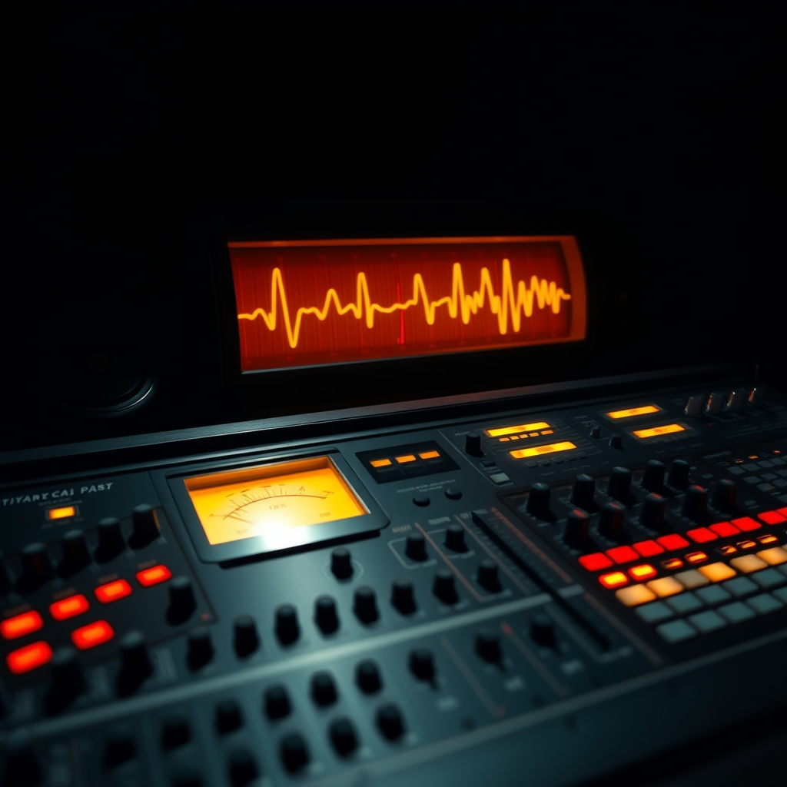
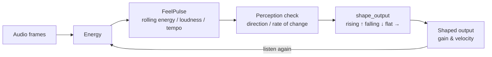

# fleet-audio

> Streaming MIDI → audio renderer with O(1) memory. Replaces the numpy OOM killer.

<p align="center">
  
</p>

**Phase 4** of the fleet infrastructure. Takes MIDI events from the CNS bus (JSONL spool or HTTP) and renders them to WAV in fixed-memory chunks. No allocation on the audio thread. No OOM. No O(duration) memory.

## The Feel Pulse — the renderer plays with the room, not just in it

The renderer gains an *ear*. [`FeelPulse`](src/feel.rs) (see [docs/feel-pulse.md](docs/feel-pulse.md)) listens to the audio stream's energy and shapes its own output by what it feels — a rising pulse pushes gain/velocity up, a falling pulse pulls them down, a flat pulse holds.



Ports the fleet's JEPA ear (`fleet-jepa-midi/vibe_matcher.py` LISTEN) and the elephant's perception-check math (`elephant/pulse.py`) into idiomatic Rust, and bridges the elephant's `volume`/`mood` dials as the pulse input.

## Architecture

```text
  MIDI Input → Lock-free SPSC Ring → Audio Thread → WAV Writer
  (JSONL/HTTP)   (MidiEvent)         (Synthesizer)   (Streaming)
```

- **Chunk size:** 1024 samples (~23ms at 44100Hz)
- **Max buffered audio:** 1 second
- **No allocation in the audio thread**
- **Lock-free ring** between MIDI input and synthesis

## Voices

| Channel | Voice | Engine |
|---------|-------|--------|
| 0 | Piano | Additive synthesis with harmonic partials |
| 1 | Bass | Subtractive with lowpass filter |
| 2 | Strings | Slow-attack pad with vibrato |
| 3 | Guitar | Plucked-string model (Karplus-Strong derivative) |
| 9 | Drums | Noise + pitched oscillators (kick, snare, hat, crash) |

## Quick Start

```rust
use fleet_audio::{Config, EventRing, MidiEvent, Synthesizer};

let ring = EventRing::new(1024);
let mut synth = Synthesizer::with_defaults();

// Feed MIDI events
ring.push(MidiEvent::note_on(0, 60, 100, 0)); // middle C

// Render a chunk
let output: &[f32] = synth.process_chunk(&ring);
// output is CHUNK_SIZE samples, ready to write or play
```

## Configuration

```toml
[fleet-audio]
sample_rate = 44100
chunk_size = 1024
max_voices = 64
ring_capacity = 1024
master_gain = 0.7
output_wav = "/var/spool/fleet-audio/output.wav"
jsonl_spool = "/var/spool/fleet-audio/midi-in"
http_port = 3007
```

## Testing

```sh
cargo test
```

64 tests covering: ring buffer (push/pop/drain/wraparound), MIDI event handling, synthesizer polyphony, voice rendering (frequency correctness, envelope behavior, note-off silencing), WAV streaming, memory boundedness, and the feel pulse (rising/falling/flat shaping, NaN guard, dials bridge, tempo/onset detection).

## Design Decisions

- **Lock-free SPSC ring:** Audio thread has hard real-time deadlines (~23ms). Any lock would cause dropouts.
- **Power-of-two capacity:** Mask-based indexing (`idx & mask`) instead of modulo — faster on every architecture.
- **Fixed voice pool:** `MAX_VOICES` slots allocated at startup. No allocation on the hot path.
- **Additive synthesis:** Each voice sums harmonic partials. Rich tone, predictable cost.
- **Streaming WAV:** Samples written and discarded per chunk. Memory is O(chunk), never O(duration).

## Part of the Fleet

fleet-audio is the audio rendering backend for:
- **fleet-ensemble** — musical coordination and CNS bus MIDI streaming
- **fleet-cns** — Collective Nervous System event bus
- **tapscript-worker** — MIDI generation from musical theory
- **songforge** — AI-assisted songwriting pipeline

## License

MIT

## Build & run

```bash
cargo build --release
# render from a JSONL event spool
cargo run --release -- --input events.jsonl --output out.wav
# watch the CNS bus spool instead (streams until stopped)
cargo run --release -- --watch ~/.hermes/cns_spool/
cargo test --release     # ring, feel-pulse, and synth unit tests
```

Check `--help` for the full flag list (chunk size, sample rate, input
mode, HTTP listener port).

## Source map

```
src/
├── main.rs      # CLI entry, mode dispatch (file / watch / HTTP)
├── config.rs    # runtime configuration + flag parsing
├── ring.rs      # lock-free SPSC ring buffer (audio thread boundary)
├── midi.rs      # MIDI event model + JSONL decoding
├── synth.rs     # fixed-memory voice synthesizer
├── voice/       # voice allocation and per-voice state
├── io/          # WAV writer (streaming), spool/HTTP sources
├── router/      # event routing from input to ring
├── wav.rs       # RIFF/WAVE chunk writer
└── feel.rs      # FeelPulse — energy tracking + perception checks
```

## Design rules (inherited from the critical-path rules)

1. **O(chunk) memory, always.** The ring holds at most 1 second of audio;
   the WAV writer flushes per chunk. Long pieces cost the same as short ones.
2. **No allocation on the audio thread.** All allocation happens at setup;
   the audio thread only reads the ring, runs voices, and writes chunks.
3. **The spool lives on ext4** (`/home/...`), never `/mnt/c` — WSL filesystem
   latency was murdering real-time playback.

## Fleet context

This replaced a numpy renderer that OOM-killed the box on pieces longer
than a few minutes. The feel pulse (Aug 2026 maturation wave) is the
audio-side port of the elephant's perception math: two numbers are a
direction, three are a rate of change — the renderer hears its own output
the way the room hears itself. Pairs with `fleet-jepa-midi` (the MIDI
corpus and vibe matcher) and the elephant's `volume`/`mood` dials.
